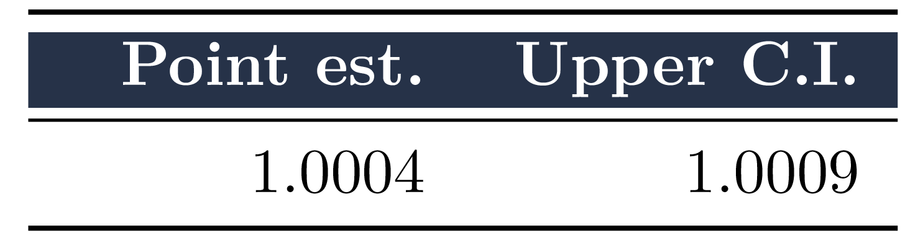
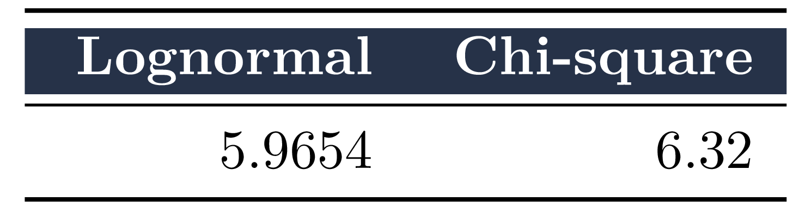

```{r}
# width = 480, height = 480, units = "px", pointsize = 12,
#     bg = "white", res = NA, family = "", restoreConsole = TRUE,
#     type = c("windows", "cairo"), antialias)


png(filename="images/plot01.png")
plot(plot01, type = "l")
abline(a=max(plot01[60:1000,2]),b=0, lty = 5, col = "red")
abline(a=min(plot01[60:1000,2]),b=0, lty = 5, col = "red")
dev.off()

png(filename="images/plot02.png")
plot(plot02, type = "l")
abline(a=max(plot02[60:1000, 2]),b=0, lty = 5, col = "red")
abline(a=min(plot02[60:1000, 2]),b=0, lty = 5, col = "red")
dev.off()


png(filename="images/plot03.png", width = 4*480, height = 500)
coda::gelman.plot(mcmc_v3)
dev.off()

```
```{r, echo = FALSE, purl = FALSE, out.width = "100%", fig.align = "center", fig.pos = "h", fig.cap = "Kernels handling"}

# l <- length(kernesm_df$hour)
# l1 <- 1 : l
# l2 <- (l + 1) : (2 * l)
Df <-  cbind.data.frame(x = plot01[,1],
                        y = plot01[,2])
# Df_soft_1 <- as.data.frame(spline(Df$x[l1], Df$y[l1]))
# Df_soft_2 <- as.data.frame(spline(Df$x[l2], Df$y[l2]))

# e_bar_dif <- max(Df_soft_1$y) - min(Df$y[l1])
# e_bar <- c(min(Df$y[l1]), e_bar_dif * .25 + min(Df$y[l1]), e_bar_dif * .5 + min(Df$y[l1]), e_bar_dif * .75 + min(Df$y[l1]), max(Df_soft_1$y))
quartiles_top5 <- quantile(plot01[250:2000,2],prob=1-5/100)
quartiles_mean <- quantile(plot01[250:2000,2],prob=1-50/100)
quartiles_bot5 <- quantile(plot01[250:2000,2],prob=1-95/100)
ggplot() + 
  geom_point(data = Df, aes(x = x, y = y, colour = y), size = 1)+
  geom_line(data = Df, aes(x = x, y = y, colour = y), size = 1)+
  geom_hline(aes(yintercept = quartiles_top5), colour=color_palette[1])+
  geom_hline(aes(yintercept = quartiles_mean), colour=color_palette[1])+
  geom_hline(aes(yintercept = quartiles_bot5), colour=color_palette[1])+
  #        annotate("text", x = Df$x[l1], y = Df$y[l1] + 0.1 , 
  #            alpha = 0.6, label = paste0(signif(Df$y[l1], 3), "°"),
  #          check_overlap = TRUE, size = 2.5, fontface = "italic") +
  scale_colour_gradient(low = color_palette[6], high = color_palette[4], 
                        # limits = c(e_bar[1], e_bar[5]),
                        # breaks = e_bar,
                        # labels =  paste0(signif(e_bar, 3), "°"),
                        aesthetics = "colour") +
  #  scale_shape_manual(values = as.numeric(levels(Df$f))[1], 
  #                    labels = c("Sumatory", "Multiplication")[1]) +
  theme(plot.title = element_text(hjust = 0.5), plot.subtitle = element_text(hjust = 0.5),
        panel.background = element_rect(fill = "white", colour = NA),
        panel.grid.major = element_line(linetype = "dashed", color = color_palette[6]),
        panel.border = element_rect(colour = "black", fill = NA, size = 0.2),
        axis.line = element_line(size = 0.2, colour = "black"),
        legend.key.size = unit(0.5, "cm"),
        legend.key.width = unit(0.2, "cm"),
        legend.key = element_rect(fill = "white", colour = NA)) +

  labs(title = "Metropolis-Hastings", subtitle = "Sampling from proposed log-normal distribution",
       caption = "(In search for convergence)", tag = waiver(),
       colour = "Value",
       plot.title = element_text(size = rel(9))) +
  scale_x_continuous(name = "t", labels = function(x) paste0(x, ""),
                     breaks = seq(0, 2000, 250)) +
  scale_y_continuous(name = "X(t)",labels = function(x) paste0(x, ""), 
                     breaks = seq(0, 50, 5))
  # guides(shape = guide_legend(order = 1), colour = guide_colourbar(order = 2))
 ggsave("images/plot01.png")
 ggsave("images/plot01B.png", width = 20, height = 10, units = "cm")
```

```{r, echo = FALSE, purl = FALSE, out.width = "100%", fig.align = "center", fig.pos = "h", fig.cap = "Kernels handling"}

# l <- length(kernesm_df$hour)
# l1 <- 1 : l
# l2 <- (l + 1) : (2 * l)
Df <-  cbind.data.frame(x = plot02[,1],
                        y = plot02[,2])
# Df_soft_1 <- as.data.frame(spline(Df$x[l1], Df$y[l1]))
# Df_soft_2 <- as.data.frame(spline(Df$x[l2], Df$y[l2]))

# e_bar_dif <- max(Df_soft_1$y) - min(Df$y[l1])
# e_bar <- c(min(Df$y[l1]), e_bar_dif * .25 + min(Df$y[l1]), e_bar_dif * .5 + min(Df$y[l1]), e_bar_dif * .75 + min(Df$y[l1]), max(Df_soft_1$y))
quartiles_top5 <- quantile(plot02[250:2000,2],prob=1-5/100)
quartiles_mean <- quantile(plot02[250:2000,2],prob=1-50/100)
quartiles_bot5 <- quantile(plot02[250:2000,2],prob=1-95/100)
ggplot() + 
  geom_point(data = Df, aes(x = x, y = y, colour = y), size = 1)+
  geom_line(data = Df, aes(x = x, y = y, colour = y), size = 1)+
  geom_hline(aes(yintercept = quartiles_top5), colour=color_palette[1])+
  geom_hline(aes(yintercept = quartiles_mean), colour=color_palette[1])+
  geom_hline(aes(yintercept = quartiles_bot5), colour=color_palette[1])+
  #        annotate("text", x = Df$x[l1], y = Df$y[l1] + 0.1 , 
  #            alpha = 0.6, label = paste0(signif(Df$y[l1], 3), "°"),
  #          check_overlap = TRUE, size = 2.5, fontface = "italic") +
  scale_colour_gradient(low = color_palette[6], high = color_palette[4], 
                        # limits = c(e_bar[1], e_bar[5]),
                        # breaks = e_bar,
                        # labels =  paste0(signif(e_bar, 3), "°"),
                        aesthetics = "colour") +
  #  scale_shape_manual(values = as.numeric(levels(Df$f))[1], 
  #                    labels = c("Sumatory", "Multiplication")[1]) +
  theme(plot.title = element_text(hjust = 0.5), plot.subtitle = element_text(hjust = 0.5),
        panel.background = element_rect(fill = "white", colour = NA),
        panel.grid.major = element_line(linetype = "dashed", color = color_palette[6]),
        panel.border = element_rect(colour = "black", fill = NA, size = 0.2),
        axis.line = element_line(size = 0.2, colour = "black"),
        legend.key.size = unit(0.5, "cm"),
        legend.key.width = unit(0.2, "cm"),
        legend.key = element_rect(fill = "white", colour = NA)) +

  labs(title = "Metropolis-Hastings", subtitle = "Sampling from proposed chi-square distribution",
       caption = "(In search for convergence)", tag = waiver(),
       colour = "Value",
       plot.title = element_text(size = rel(9))) +
  scale_x_continuous(name = "t", labels = function(x) paste0(x, ""),
                     breaks = seq(0, 2000, 250)) +
  scale_y_continuous(name = "X(t)",labels = function(x) paste0(x, ""), 
                     breaks = seq(0, 50, 5))
  # guides(shape = guide_legend(order = 1), colour = guide_colourbar(order = 2))
 ggsave("images/plot02.png")
```

```{r, echo = FALSE, purl = FALSE, out.width = "100%", fig.align = "center", fig.pos = "h", fig.cap = "Kernels handling"}
# plot(X,Y,main="Chemical Data",xlab="Day of the measurement",ylab="Concentration")
# l <- length(kernesm_df$hour)
# l1 <- 1 : l
# l2 <- (l + 1) : (2 * l)

Df <-  cbind.data.frame(x = plot04[,1],
                        y = plot04[,2])


fit <- lm(Df$y ~ poly(x = Df$x, degree = 3))
# prd <- data.frame(X,Y) # data.frame(hp = seq(from = range(mtcars$hp)[1], to = range(mtcars$hp)[2], length.out = 100))
poly_model_predicted <- predict(fit, newdata = Df, se.fit = TRUE)

ymin <- poly_model_predicted$fit - 1.96 * poly_model_predicted$se.fit
ymean <- poly_model_predicted$fit
ymax <- poly_model_predicted$fit + 1.96 * poly_model_predicted$se.fit

# ggplot(prd, aes(x = X, y = Y), colour = "black") +
#   # theme_bw() +
#   geom_point() +
#   geom_line(aes(x = X, y = err$fit), colour = "red")+
#   geom_smooth(aes(ymin = ymin, ymax = ymax), stat = "identity") 
  # geom_point(data = mtcars, aes(x = hp, y = mpg))


# Df_soft_1 <- as.data.frame(spline(Df$x[l1], Df$y[l1]))
# Df_soft_2 <- as.data.frame(spline(Df$x[l2], Df$y[l2]))

# e_bar_dif <- max(Df_soft_1$y) - min(Df$y[l1])
# e_bar <- c(min(Df$y[l1]), e_bar_dif * .25 + min(Df$y[l1]), e_bar_dif * .5 + min(Df$y[l1]), e_bar_dif * .75 + min(Df$y[l1]), max(Df_soft_1$y))
quartiles_top5 <- quantile(plot01[250:2000,2],prob=1-5/100)
quartiles_mean <- quantile(plot01[250:2000,2],prob=1-50/100)
quartiles_bot5 <- quantile(plot01[250:2000,2],prob=1-95/100)
ggplot() + 
  geom_point(data = Df, aes(x = x, y = y, colour = y), size = 2)+
  # geom_line(data = Df, aes(x = x, y = y, colour = y), size = 1)+
  # geom_hline(aes(yintercept = quartiles_top5), colour=color_palette[1])+
  # geom_hline(aes(yintercept = quartiles_mean), colour=color_palette[1])+
  # geom_hline(aes(yintercept = quartiles_bot5), colour=color_palette[1])+
         annotate("text", x = 25, y = 0.8,
             label = "Polinomial model of 3rd degree", colour = color_palette[8],
           check_overlap = TRUE, size = 3.5, fontface = "italic") +
  geom_line(data = Df, aes(x = Df$x, y = ymean), colour = "red")+
  geom_smooth(data = Df, aes(x = x, y = ymean, ymin = ymin, ymax = ymax), stat = "identity", colour = color_palette[2]) +
  scale_colour_gradient(low = color_palette[6], high = color_palette[4], 
                        # limits = c(e_bar[1], e_bar[5]),
                        # breaks = e_bar,
                        # labels =  paste0(signif(e_bar, 3), "°"),
                        aesthetics = "colour") +
  #  scale_shape_manual(values = as.numeric(levels(Df$f))[1], 
  #                    labels = c("Sumatory", "Multiplication")[1]) +
  theme(plot.title = element_text(hjust = 0.5), plot.subtitle = element_text(hjust = 0.5),
        panel.background = element_rect(fill = "white", colour = NA),
        panel.grid.major = element_line(linetype = "dashed", color = color_palette[6]),
        panel.border = element_rect(colour = "black", fill = NA, size = 0.2),
        axis.line = element_line(size = 0.2, colour = "black"),
        legend.key.size = unit(0.5, "cm"),
        legend.key.width = unit(0.2, "cm"),
        legend.key = element_rect(fill = "white", colour = NA)) +

  labs(title = "Chemical Data", subtitle = "Data from imported file 'chemical.RData'",
       caption = "(In search for a posible fit)", tag = waiver(),
       colour = "Value",
       plot.title = element_text(size = rel(9))) +
  scale_x_continuous(name = "Day of the measurement", labels = function(x) paste0(x, ""),
                     breaks = seq(0, 50, 5)) +
  scale_y_continuous(name = "Concentration",labels = function(x) paste0(x, ""), 
                     breaks = seq(0, 2, .2))
  # guides(shape = guide_legend(order = 1), colour = guide_colourbar(order = 2))
 ggsave("images/plot04.png", width = 20, height = 8, units = "cm")
```

```{r, echo = FALSE, purl = FALSE, eval = FALSE, out.width = "60%", fig.align = "center", fig.pos = "h", fig.lp = "test", fig.cap = "\\textit{Extract of imported data,}", out.extra='angle=0'}
# lets plot it frequency (in percentage of the whole) in function of population(amount of people per city)
Df <- plot01
# the breaks used for the data both in the historgram and X labels
brk <- seq(min(Df$Population), max(Df$Population), (max(Df$Population)-min(Df$Population))/32)
brk2<- seq(min(Df$Population), max(Df$Population), (max(Df$Population)-min(Df$Population))/16)
#create the labels of the total amount of cityes belonging to each gap
lbl = rep(0,length(brk))
for(i in 2:length(brk)){
 lbl[i] =  length(which(Df$Population > brk[i-1] & Df$Population <= brk[i]))
}
lbl2 = lbl
lbl2[which(lbl == 0)] <- NA
# lbl2 <- lbl[-1
# lbl2
ggplot(Df, aes(Df$Population))+
  geom_histogram(aes(y =(..count..)/sum(..count..), fill = ..count..), breaks = brk)+
  theme(plot.title = element_text(hjust = 0.5), plot.subtitle = element_text(hjust = 0.5), 
        panel.background = element_rect(fill = "white", colour = NA),
        panel.grid.major = element_line(linetype = "dashed", color = color_palette[6]),
        panel.border = element_rect(colour = "black", fill = NA, size = 0.2),
        axis.line = element_line(size = 0.2, colour = "black"),
        axis.text.x = element_text(angle = 90, hjust = 1),
        legend.key.size = unit(0.5, "cm"),
        legend.key.width = unit(0.2, "cm"),
        legend.key = element_rect(fill = "white", colour = NA)) +

  annotate("text", x = brk- 14000, y = (lbl/length(Df$Population)) + 0.03,
             alpha = 1, label = lbl2,
           check_overlap = FALSE, size = 3, fontface = "italic") +
  # chating a little bit, lets add a point that has aes of 0 but its at 100% for the complete scale to be shown
  annotate("text", x = (Df$Population[1]), y = 1,
             alpha = 0, label = "wakekekekekekekek",
           check_overlap = FALSE, size = 3, fontface = "italic")+
  
   scale_fill_gradient(low = color_palette[1], high = color_palette[2],
                        breaks = c(0, round(length(Df$Population)*.25, 0),
                                   round(length(Df$Population)*.5, 0), 
                                   round(length(Df$Population)*.75, 0), 290),
                        #labels =  c("0%","25%","50%","75%", "100%"),
                       aesthetics = c("colour", "fill"))+

  labs(title = "Histogram of cities based on population", 
       subtitle = paste0("Statistics Sweden. (100% = ", length(newpop$Code), " cities.)"), 
       caption = "(Population on December 31, 2009 and Population Changes 2009)", 
       tag = waiver(), colour = waiver(), shape = waiver(),
       plot.title = element_text(size = rel(9)))+
  scale_x_continuous(name = "Population", 
                     labels = function(x) paste0(round(x/1000, 2), "k"),
                     breaks = brk2)+
    scale_y_continuous(name = paste0("Frequency"),
                     labels = function(x) paste0(x * length(Df$Code), " cities"),
                     breaks = seq(0, 1, .1),
                     sec.axis = sec_axis(~.*1,
                                         # name = paste("Percentage out of ", length(Df$Code), " cities"),
                     labels = function(x) paste0(x*100, "%"), breaks = seq(0, 1, 0.1)))
# ggsave("images/plot01.png")
```


```{r, echo = FALSE, purl = FALSE, eval = TRUE, out.width = "60%", fig.align = "center", fig.pos = "h", fig.lp = "test", fig.cap = "\\textit{Extract of imported data,}", out.extra='angle=0'}
df <- data.frame(a = 1, b = 2)
names(df)[1] <- cell_spec(names(df)[1], background = "yellow")
kable(df, escape = FALSE)

ugly_object <- (coda::gelman.diag(mcmc_v3, autoburnin = FALSE, confidence = 0.95))
# fix(ugly_object)

me <- data.frame(x1 = ugly_object$psrf[1], x2 = ugly_object$psrf[2])
# Change background color
# names(me) <- cell_spec(names(me), background = "white")

kable_as_image(
  row_spec(
  column_spec(
    kable_styling(
      kable(me,
            "latex",
            digits = 4,
            col.names = c("Point est.", "Upper C.I."),
            booktabs = TRUE),
      latex_options = c("striped", "scale_down"),
      full_width = FALSE,
      stripe_color = "white"),
    column = c(1,2),
    width = "2cm",
    background = "white"),
  row = 0, background = color_palette[1], bold = TRUE,
  color = "white"),
  filename = "images/table01")

```

```{r, echo = FALSE, purl = FALSE, eval = TRUE, out.width = "60%", fig.align = "center", fig.pos = "h", fig.lp = "test", fig.cap = "\\textit{Extract of imported data,}", out.extra='angle=0'}
# ```{r, echo = FALSE, purl = FALSE, eval = TRUE, out.width = "60%", fig.align = "center", fig.pos = "h", fig.cap = "\\label{testPlot}This caption has LaTeX with {\\small small text} and some {\\footnotesize footnote text and \\textbf{bold footnote}} and \\textit{italic} and $\\infty$", out.extra='angle=15'}

# ugly_object <- (coda::gelman.diag(mcmc_v3, autoburnin = FALSE, confidence = 0.95))
# fix(ugly_object)
me <- data.frame(x1 = mean_a, x2 = mean_b)

kable_as_image(
  row_spec(
  column_spec(
    kable_styling(
      kable(me,
            "latex",
            digits = 4,
            col.names = c("Lognormal", "Chi-square"),
            booktabs = TRUE),
      latex_options = c("striped", "scale_down"),
      full_width = FALSE,
      stripe_color = "white"),
    column = c(1,2),
    width = "2cm",
    background = "white"),
    row = 0, background = color_palette[1], bold = TRUE,
  color = "white"),
  filename = "images/table02")

```
