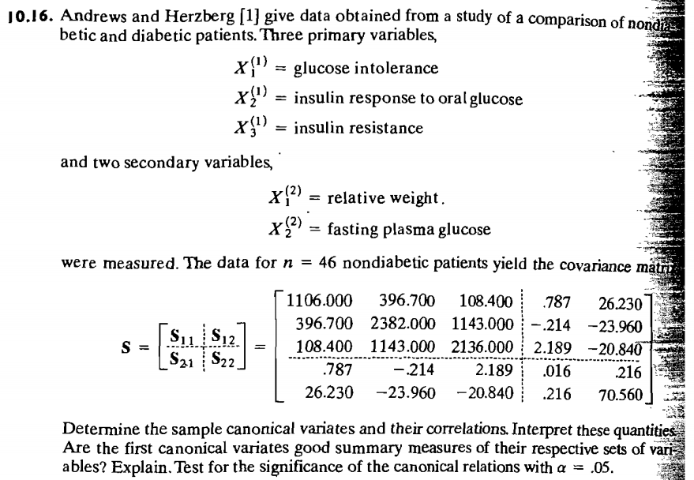

```{r setup, include=FALSE}
knitr::opts_chunk$set(echo=TRUE, warning=FALSE, message=FALSE, 
          fig.align = "center", size = 5)
```

# Question: Canonical correlation analysis by utilizing suitable software

## Data
```{r}
library(dplyr); library(knitr)

S <- as.matrix(read.table("P10-16.dat")); kable(S)
R <- cov2cor(S)
## 
```


```{r echo=FALSE, out.width="100%"}

```


\pagebreak

## a) Test at the 5% level if there is any association between the groups of variables.
```{r}
inverse_sqrtm <- function(M){
  stopifnot(is.matrix(M))
  
  U <- eigen(M)$vectors
  D <- diag(eigen(M)$values)
  # print ( U%*%D%*%solve(U) )  # should be same as M
  M_sqrt_inv <- U%*%solve(sqrt(D))%*%solve(U) 
  return(M_sqrt_inv)
}


ccm_Func <- function(M, p, q, z=FALSE){
  
   M11=M[1:p, 1:p]; M12=M[1:p, (p+1):(p+q)] 
   M21=t(M[1:p, (p+1):(p+q)]); M22=M[(p+1):(p+q), (p+1):(p+q)]
   CCM1=inverse_sqrtm(M11)%*%M12%*%solve(M22)%*%M21%*%inverse_sqrtm(M11)
   squared_rhos <- eigen(CCM1)$values
   # rhos <- sqrt(squared_rhos)
   e_vectors <- eigen(CCM1)$vectors
   
   return(squared_rhos)
}

R_res = ccm_Func(S,p=3,q=2); R_res

test_statistic <- function(n,p,q, squared_rhos){
  -(n-1-0.5*(p+q+1))*log(prod(1-squared_rhos))  }
n = 46; p=3; q=2
t <- test_statistic(n=n, p=p, q=q, squared_rhos=R_res)
c <- qchisq(p=1-0.05, df=p*q)

kable(t(c(t,c, as.character(t>c) )), 
      col.names=c("Test Statistic", "Critical Value", "Check t > c"), digits = 3)
```

We REJECT the null hypothesis at 5% significance level. Therefore we can say that that is SIGNIFICANT correlation between the groups of variables. The test statistic `r t` is GREATER than the critical value `r c`.


\pagebreak

## b) How many pairs of canonical variates are significant?
```{r}
options(digits=7); sqrt(R_res)
```
There are two significant canonical correlations `r sqrt(R_res[1:2])` because they are not very close to zero.


## c) Interpret the "significant" squared canonical correlations.
## Tip: Read section "Canonical Correlations as Generalizations of Other Correlation Coefficients".

"Glucose intolerance" and "insulin response to oral glucose"" have a recognizable effect on "relative weight" and "fasting plasma resistance" among patients. Patients who are glucose intolerant will tend to be fatter.


## d) Interpret the canonical variates by using the coefficients and suitable correlations.
```{r}

A_B_calc_Func <- function(M, p, q, z=FALSE, significant=2){
  
   M11=M[1:p, 1:p]; M12=M[1:p, (p+1):(p+q)] 
   M21=t(M[1:p, (p+1):(p+q)]); M22=M[(p+1):(p+q), (p+1):(p+q)]
   CCM1=inverse_sqrtm(M11)%*%M12%*%solve(M22)%*%M21%*%inverse_sqrtm(M11)
   squared_rhos <- eigen(CCM1)$values
   # rhos <- sqrt(squared_rhos)
   e_vectors <- eigen(CCM1)$vectors[,1:significant]
   
   if(z==TRUE){
     a_s <- inverse_sqrtm(M11)%*%e_vectors
     f_vectors <- inverse_sqrtm(M22)%*%M21%*%inverse_sqrtm(M11)%*%e_vectors
     b_s <- inverse_sqrtm(M22)%*%f_vectors
   }else{
     a_s <- t(e_vectors)%*%inverse_sqrtm(M11)
     ff <- (1/(sqrt(squared_rhos)))[1:significant]
     f_vectors <- ff*inverse_sqrtm(M22)%*%M21%*%inverse_sqrtm(M11)%*%e_vectors
     b_s <- t(f_vectors)%*%inverse_sqrtm(M22)
   }
   
   return(list(a_s=a_s, b_s=b_s))
}

U_V = A_B_calc_Func(S,p=3,q=2, significant = 2)

options(digits=10)
kable(U_V$a_s, col.names=sapply(1:ncol(U_V$a_s), 
                    FUN=function(i) paste0("a_",i)) )

kable(U_V$b_s, col.names=sapply(1:ncol(U_V$b_s), 
                    FUN=function(i) paste0("b_",i)) )

options(digits=3)
```

Because in this case the covariance matrix was used, $U$ and $V$ are the canonical variates and they are expressed as $U = aX$ and $V = bX$ where $X$ is the variables and $a$ and $b$ are the vectors of the coefficients of the linear combinations of the variates that summarise the correlation between the variables.

A `r unclass(U_V$a_s[1,1])` **change** in "Glucose intolerance" and a `r unclass(U_V$a_s[2,1])` **change** in "insulin response to oral glucose" are significantly correlated with a `r unclass(U_V$b_s[1,1])` **change** in "relative weight" and a `r unclass(U_V$b_s[2,1])` **change** in "fasting plasma resistance".


## e) Are the "significant" canonical variates good summary measures of the respective data sets?
## Tip: Read section "Proportions of Explained Sample Variance".


## f) Give your opinion on the success of this canonical correlation analysis.

